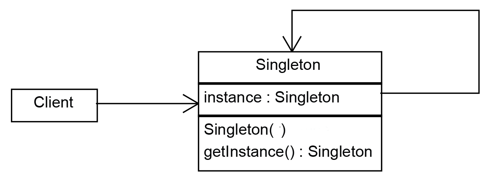

e# Singleton Pattern

## Oficial Intention

Garantee that a class have only one instance running on app and bring an global access point to itself.

This pattern breaks single responsability principle

## Why only one instance?

When we have shared resources in a app, like databases, graphical intefaces, loggers, and we need only one instance of each resource running on application.

## Global Access Point

You can allow global access to the Singleton throughout your application, just like we do with global variables

An Singleton advantage it's that we can protect the instance with encapsulation, avoiding that other code overrides its value



## Implementation

```ts
export class Singleton {
  private static _instance: Singleton | null = null;

  private constructor() {
    // new not allowed outside the class
  }

  static get instance(): Singleton {
    if (Singleton.instance === null) {
      Singleton._instance = new Singleton();
    }
    return Singleton.instance;
  }
}

const instanceOne = Singleton.instance;
const instanceTwo = Singleton.instance;

console.log(instanceOne === instanceTwo); // true
```

## Applicability

- When the class need to have only one instance available in all your application
- When realize that you're using global variables to maintain important program parts that are used throughout the application

## Consequences

- Good
  - Controlled access to an unique instance
  - Easy to allow an large number of instances in case you change idea
  - Uses lazy instantiation, the Singleton is created in the moment of use
  - Replace global variables
- Bad
  - Is more difficult to test
  - Break single responsability principle
  - Need special treatment em concurrency cases
  - Erich Gamma describes that this would be the only pattern he remove if he will refactor the book
